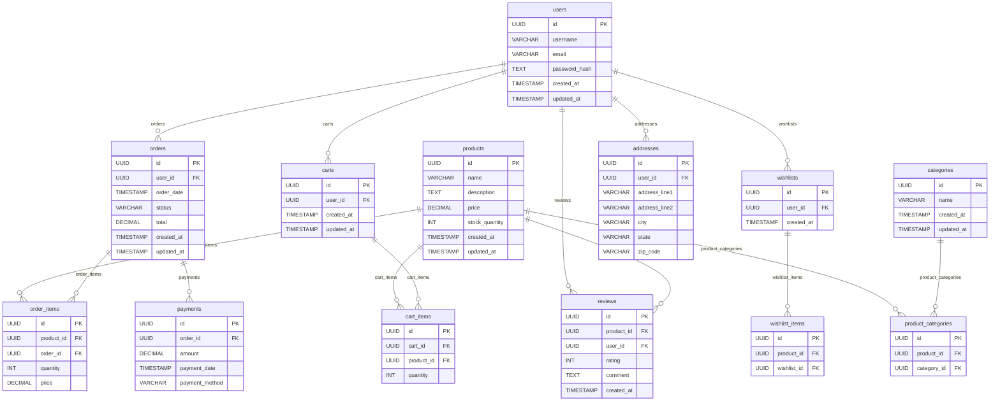

# Project Setup

Create a .env file

```text
DB_HOST=
DB_USERNAME=
DB_PASSWORD=
DB_NAME=
DB_PORT=5432
PORT=4000
DATABASE_URL=
```

```bash
docker copmpose up -d
npm install
npm run dev:api
npm run migrate
npm run dev:client
```

## Database Diagram


